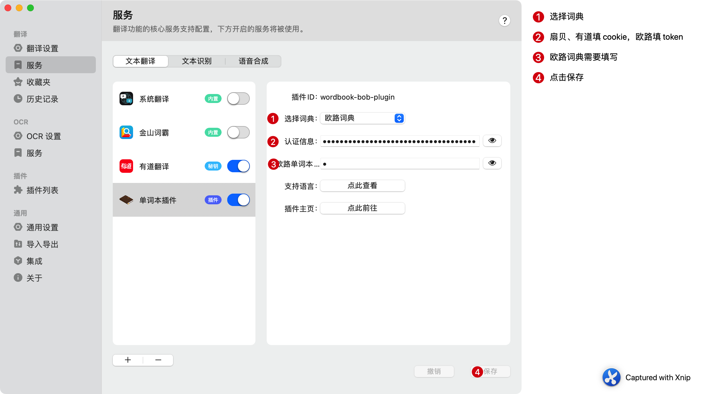
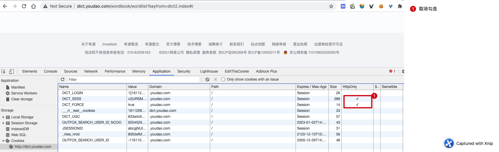
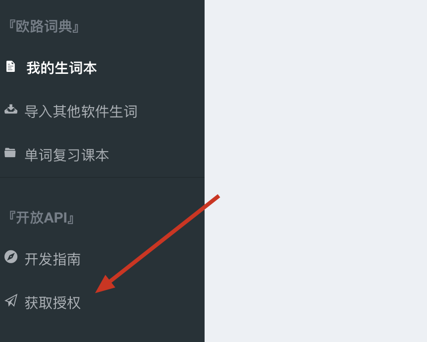
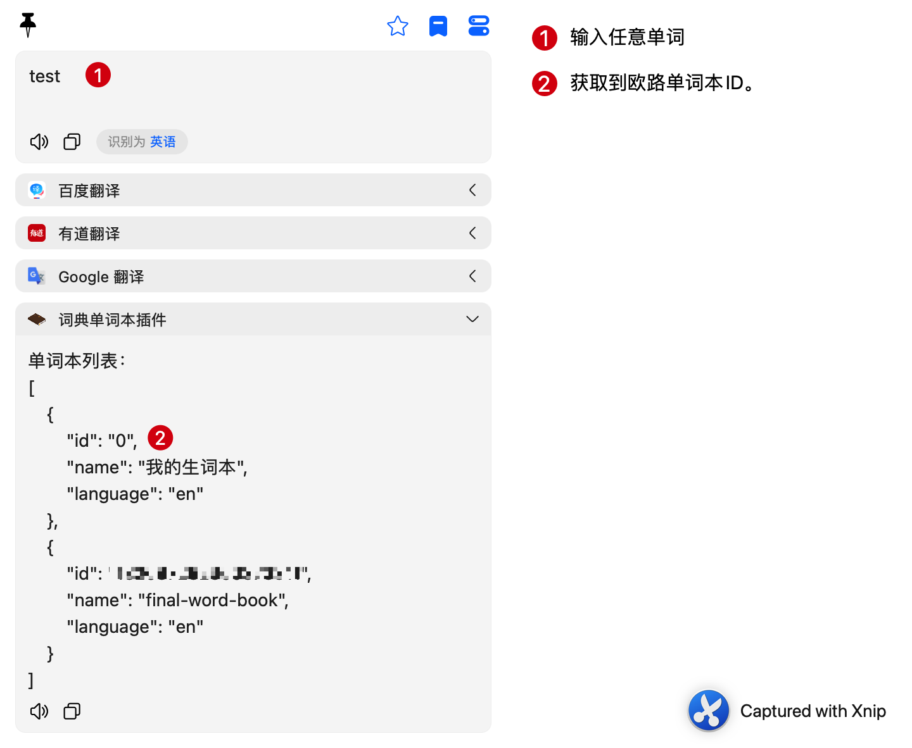
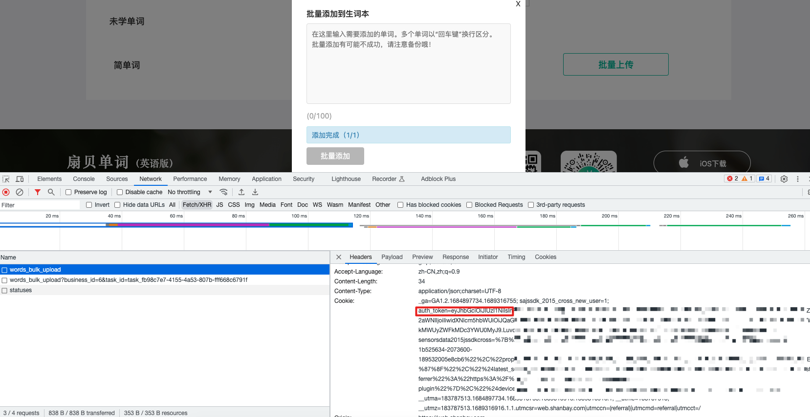
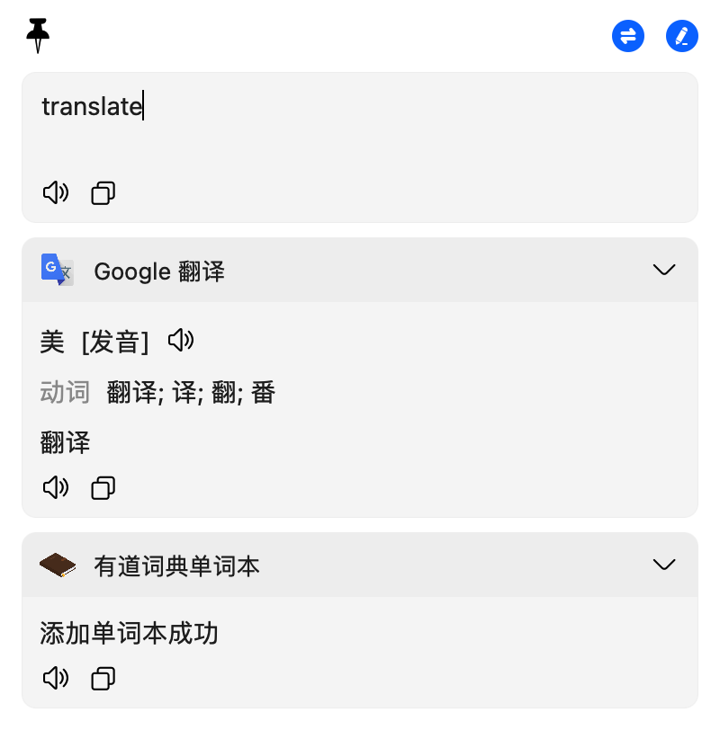

# wordbook-bob-plugin

这是一个 [Bob](https://github.com/ripperhe/Bob) 的翻译插件，但是该插件不对输入的文本进行翻译，听起来不可思议，但的确如此。该插件主要是将输入的英文单词或短语通过接口的方式同步到 `有道词典` 、`欧路词典`、`扇贝单词`、`墨墨背单词`
的单词本中，以方便对查询过的单词进行集中复习。

## 特性

1、`有道词典` 仅实现了通过 cookie 的方式添加单词到单词本；无法使用账号登录，[因为 Bob 提供的 API 无法获取到请求返回的
cookie](https://github.com/ripperhe/Bob/issues/115)。

2、`欧路词典` 是通过开放 api 添加到指导单词本，但是需要指定单词本的 id，可以通过 api 获取单词本 id。

3、`扇贝单词` 是通过 api 添加到指导单词本，需要登录后从网页获取 auth_token

4、`墨墨背单词` 是通过开放 api 添加到云词本，需要在 App 中开启开放 API 并获取 JWT Token，同时需要指定云词本的 id。
## 设置

## 有道词典获取 cookie

1、[登录有道词典](https://dict.youdao.com/)

2、如下图操作：

3、在控制台执行 `document.cookie` 获取到 cookie

## 欧路词典获取 token

1、[登录欧路词典](https://dict.eudic.net/)

2、在右上角「账户管理」获取授权

3、获取单词本 id
> 如果不知道单词本 id，可以先不填写单词本 id, 输入任意单词查询后，会返回所有的单词本 id，选择其中你需要的 id 填入即可。

## 扇贝单词获取 auth_token
1、[登录扇贝](https://www.shanbay.com/)

3、随便点击一个页面，获取 cookie 中的 auth_token，确保 auth_token 正确

## 墨墨背单词获取 token

1、打开墨墨背单词 App

2、进入「我的」->「更多设置」->「实验功能」->「开放 API」，申请并复制 Token

3、在 Bob 插件设置中填写 Token 到「认证信息」，词典类型选择「墨墨背单词」

4、获取云词本 id
> 如果不知道云词本 id，可以先不填写云词本 id，点击「验证」后，会返回所有的云词本 id，选择你需要的 id 填入「墨墨单词本 id」即可。

## 效果

